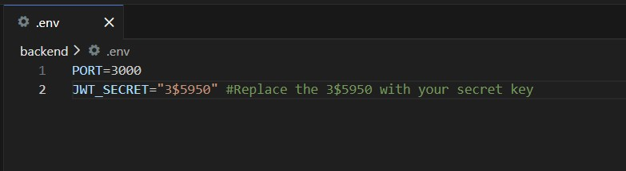

# CSE110_Project
Fresh repository with main branch.

## To run the game for the first time:

If you have Windows, change your terminal to WSL. If you have MacOS, skip this step and run the commands below.

Go to /backend and run ```npm install```

Go to /frontend and run ```npm install```

Go to /backend and run ```mkdir data```  

Go to /backend/src/data and run ```npx tsx question_db.ts``` and ```npx tsx user_db.ts``` (only type these commands if you don't have the databases under backend/data)

Go to /backend and create a ```.env``` file. Here, you will type the following contents:




## To run the game for any subsequent time:

Go to /frontend and run ```npm run dev```

Go to /backend and run ```npm start```


Game will open on browser.  

